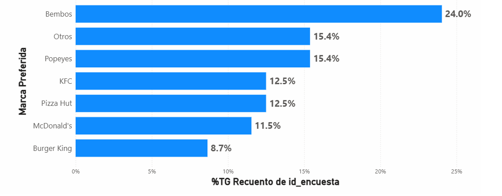
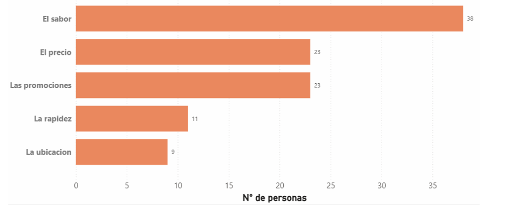
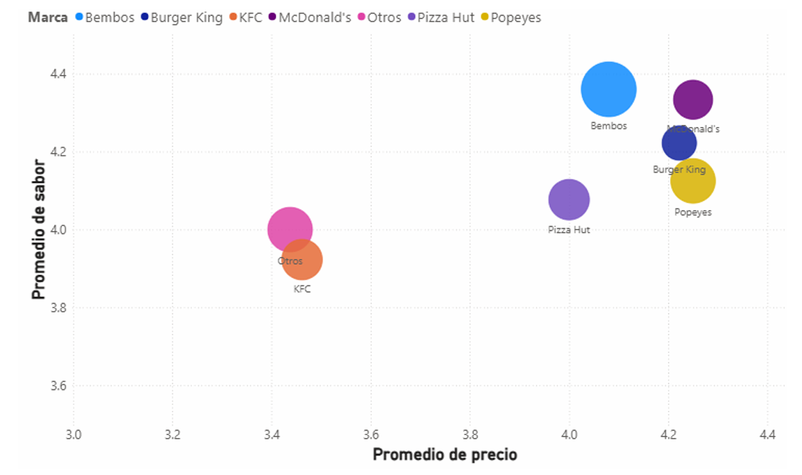
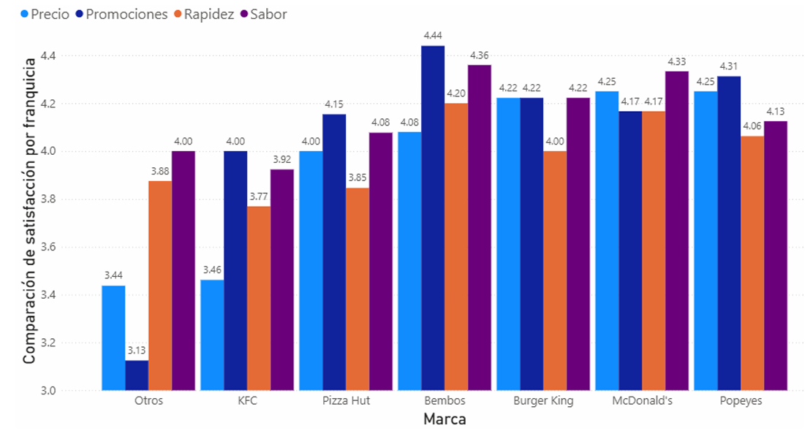

# Análisis BI de Preferencias del Consumidor de Fast Food

Solución integral de Inteligencia de Negocios (BI) diseñada para analizar la cuota de mercado (Market Share), los índices de satisfacción (CSAT) y los patrones de consumo de franquicias de comida rápida.

## Arquitectura y Tecnologías
*   **Procesamiento de Datos (ELT):** Python (Pandas, Numpy)
*   **Modelado de Datos:** Metodología Hefesto, Esquema Estrella (Star Schema)
*   **Visualización:** Power BI
*   **Fuentes de Datos:** Encuestas de mercado y evaluación de consumidores

## Estructura del Repositorio

### 1. Extracción, Carga y Transformación (ELT)
Se desarrollaron scripts en Python para la limpieza, conversión y estandarización de los datos crudos extraídos de las encuestas.
*   **LIMPIEZA.py:** Script principal para la depuración de datos, tratamiento de valores nulos y normalización de variables.
*   **division.py:** Script para la segmentación de datos y estructuración preliminar de las dimensiones.

### 2. Modelado de Datos (Data Warehouse)
Diseño del modelo multidimensional para optimizar el análisis OLAP, definiendo la tabla de hechos a nivel atómico y sus dimensiones correspondientes.
*   **Modelo_Estrella_BI.xlsx:** Matriz de configuración y diseño lógico del esquema estrella bajo la Metodología Hefesto.
*   **BD_Encuesta_Limpia.xlsx:** Base de datos consolidada, estructurada y lista para la conexión con Power BI.

## Visualizaciones e Insights Clave
El modelo de datos sustenta un dashboard interactivo que permite descubrir hallazgos estratégicos de negocio. A continuación, se presentan algunos de los análisis más relevantes:

**Preferencia de Marca (Market Share)**

**Factores Decisivos de Compra**

**Análisis de Riesgo Competitivo (Caso KFC)**

**Comparativa de Satisfacción por Franquicia**

---
*Nota: Puedes explorar el resto de los análisis visuales (segmentación geográfica, demográfica, sensibilidad al precio y frecuencia de consumo) en el directorio [Dashboards](./Dashboards).*
